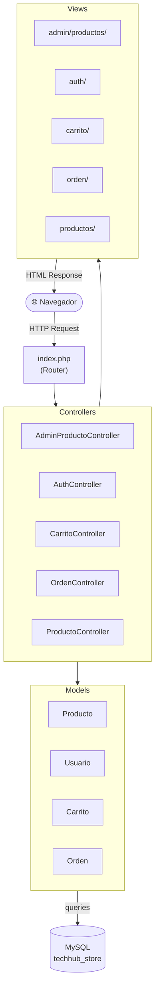

```mermaid
flowchart TD
    Browser(["🌐 Navegador"])
    Router["index.php\n(Router)"]

    subgraph CONTROLLERS["Controllers"]
        C1["AdminProductoController"]
        C2["AuthController"]
        C3["CarritoController"]
        C4["OrdenController"]
        C5["ProductoController"]
    end

    subgraph MODELS["Models"]
        M1["Producto"]
        M2["Usuario"]
        M3["Carrito"]
        M4["Orden"]
    end

    subgraph VIEWS["Views"]
        V1["admin/productos/"]
        V2["auth/"]
        V3["carrito/"]
        V4["orden/"]
        V5["productos/"]
    end

    DB[("MySQL\ntechhub_store")]

    Browser -->|"HTTP Request"| Router
    Router --> CONTROLLERS
    CONTROLLERS --> MODELS
    MODELS -->|"queries"| DB
    CONTROLLERS --> VIEWS
    VIEWS -->|"HTML Response"| Browser
```
